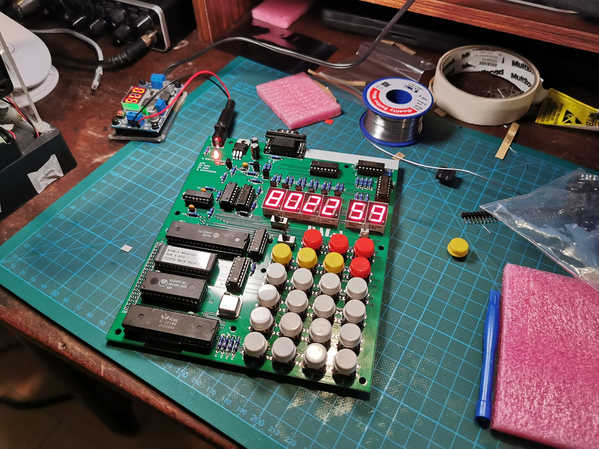

# PAL-1 Hacks
Dump of 6502 Assembly code for the PAL-1 SBC.

## Prequisties
- [cc650](https://cc65.github.io) cross development kit.
- [srecord](http://srecord.sourceforge.net) tool kit.
- [GNU Make](https://www.gnu.org/software/make/) tool.
- [minicom](https://salsa.debian.org/minicom-team/minicom) serial communication program.
### Mac OS Instructions
- Install cc65 `brew install cc65`
- Install srecord `brew install srecord`
- Install minicom `brew install minicom`

## Programs
### `kimio` -> Demonstration Of KIM-1 Onbaord IO
Using KIM-1 keypad and dispay subroutines built into ROM.